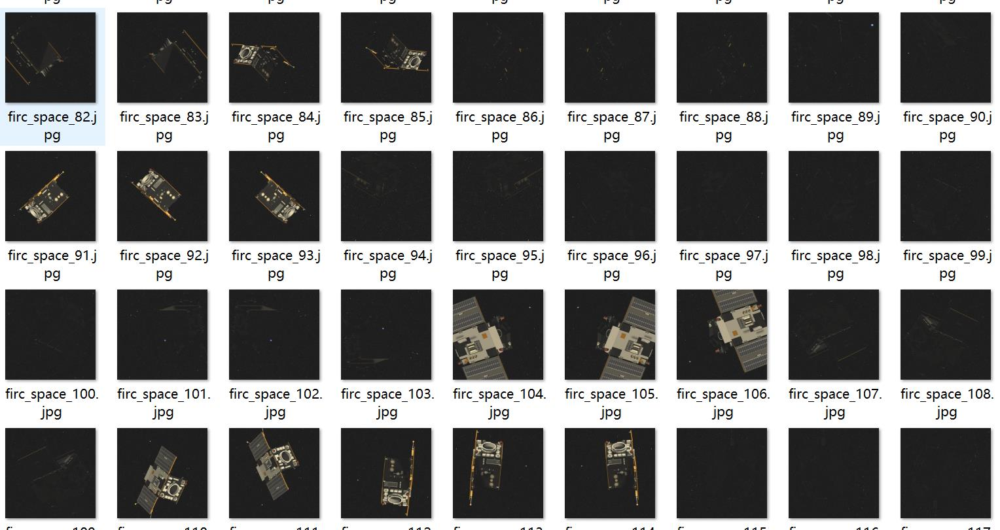
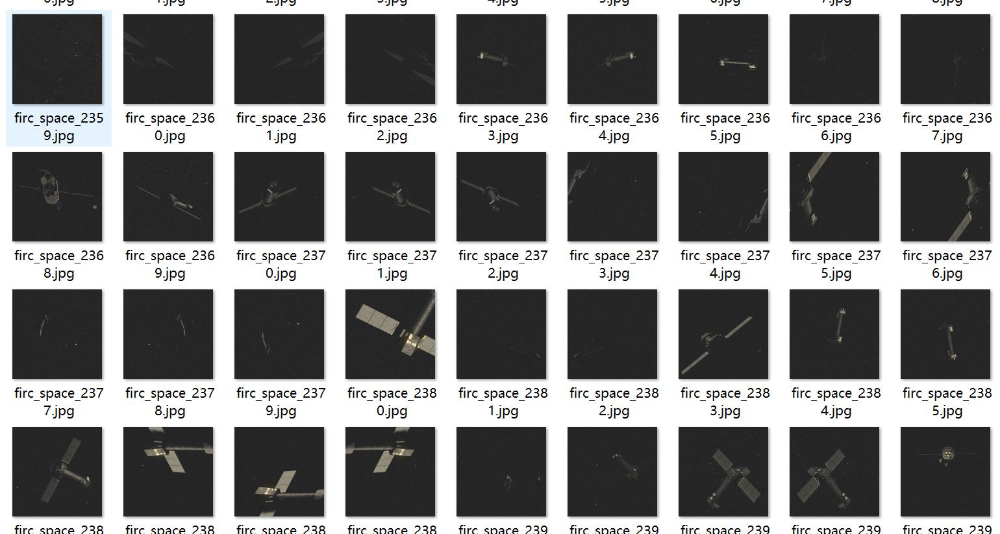
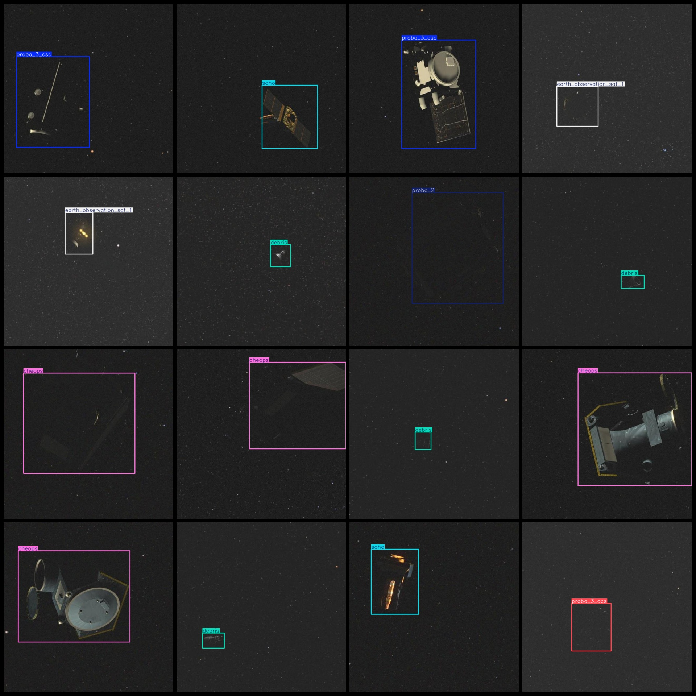
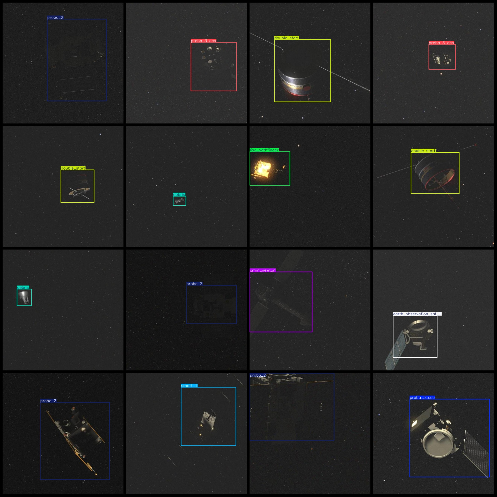

# Space Debris Detection Dataset in VOC+YOLO Format with 2467 Images of 11 Categories

Note: Half of the images are original, and the remaining are enhanced. The dataset format is Pascal VOC with a txt file that contains only the JPG images and their corresponding VOC XML files and 
YOLO txt files.

Image count (number of JPG files): 2467
Annotation count (number of xml files): 2467
Annotation count (number of txt files): 2467
Number of categories: 11

The number of bounding boxes for each category:
- Cheops (exoplanetary feature detection satellite): 244 boxes = 244 images
- Debris (space debris): 218 boxes = 218 images
- Double Start (double star): 229 boxes = 229 images
- Earth Observation Satellite 1 (EO-1): 211 boxes = 211 images
- Lisa Pathfinder (LISA Pathfinder): 223 boxes = 223 images
- Proba-2 (Proba-2 satellite): 243 boxes = 243 images
- Proba-3 CSC (Proba-3 Circular SAR): 227 boxes = 227 images
- Proba-3 OCS (Proba-3 Optical Satellite): 199 boxes = 199 images
- Smart-1 (SMART-1 Lunar lander): 222 boxes = 222 images
- Soho (Solar and Solar Flare Observatory): 217 boxes = 217 images
- XMM-Newton (XMM-Newton satellite): 234 boxes = 234 images
Total bounding box count: 2467
Image resolution: 640x640
Annotation tool used: labelImg
Annotation rules: draw bounding boxes for each category
Important note: The dataset does not include training/validation/test splits; you will need to manually divide it.
Special notice: This dataset does not guarantee any accuracy in the trained models or weight files.
Image preview:

Image

Here is a pay link on Stripe ( https://buy.stripe.com/3cs8yP7sY87d0vu9AB ). Please contact me lonlonago@foxmail.com after funding $89, and I will send you a complete data files , thank you!

